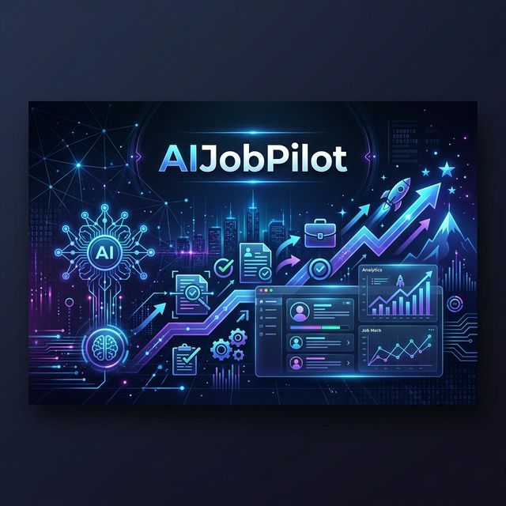

# 🚀 AIJobPilot: The Ultimate Career Command Center



AIJobPilot is a professional-grade, AI-driven ecosystem designed to automate the entire job hunting lifecycle. From AI-powered job discovery and automated scraping to ATS-optimized CV building and real-time application tracking, AIJobPilot is built for power users who want to dominate the job market with data-driven precision.

---

## ✨ Key Features

### 🛠️ 1. Career Command Center (SaaS Dashboard)
A high-density React dashboard that serves as your central hub.
- **Kanban-Style Tracking**: Manage applications through various stages (Applied, Interview, Offer, Rejected).
- **Match Scoring**: Real-time AI evaluation of how well your profile aligns with specific job descriptions.
- **Unified Interface**: Seamless integration with all backend tools and browser extensions.

### 📄 2. ATS-Optimized CV Builder
Stop guessing if your CV will pass the filters.
- **Real-time ATS Scoring**: Instantly see your score against target job descriptions.
- **AI Keyword Injection**: Automatically suggests and integrates missing skills and keywords.
- **Sleek Templates**: Professional, clean designs that prioritize readability for both humans and AI.

### 🕷️ 3. Intelligent Job Scraper & Extractor
Automated data gathering from across the web.
- **Multi-Portal Support**: Deep integration with LinkedIn, Google Jobs, Indeed, Bayt, Naukri, and more.
- **Headless Extraction**: Powered by Playwright for high-reliability data extraction.
- **Chrome Extensions**: Dedicated tools to extract requirements directly from any career page with one click.

### 🤖 4. AI Bridge & Autofiller
- **Request Tunneling**: Seamlessly send extracted job data to the backend for AI processing.
- **Automatic Form Handling**: Smarter autofilling that understands complex form fields.
- **Audit Logging**: Every action is logged to PostgreSQL for full traceability.

---

## 🛠️ Tech Stack

### Frontend
- **Framework**: [React.js](https://reactjs.org/) (Vite)
- **Styling**: Vanilla CSS with modern SaaS aesthetics
- **Auth**: [Clerk](https://clerk.dev/)
- **Visuals**: Glassmorphism & High-Density UI

### Backend & AI
- **Runtime**: [Node.js](https://nodejs.org/) (ESM)
- **Database**: [PostgreSQL](https://www.postgresql.org/)
- **AI Models**: OpenAI GPT-4o, Anthropic Claude 3.5
- **Automation**: [Playwright](https://playwright.dev/)

### Extensions
- **Platform**: Manifest V3 (Chrome Extension)
- **Capabilities**: DOM Scraping, API Bridge, Interactive UI

---

## 🏗️ Project Structure

```text
├── frontend/             # React-based Command Center
├── Tool1/                 # Backend AI Engine & PDF Processing
├── tool3/                 # Chrome Extension (Job Extractor)
├── tool4/                 # Advanced Multi-Portal Scraper
├── CVBuilder/             # AI-Powered CV Optimization Engine
└── docs/                  # Documentation and Assets
```

---

## 🚀 Getting Started

### Prerequisites
- Node.js (v18+)
- PostgreSQL
- API Keys (OpenAI, Anthropic, Clerk)

### Installation

1. **Clone the Repo**
   ```bash
   git clone git@github.com:SalmanAgha/AIJobPilot.git
   cd AIJobPilot
   ```

2. **Setup Frontend**
   ```bash
   cd frontend
   npm install
   npm run dev
   ```

3. **Setup Backend**
   ```bash
   cd Tool1
   npm install
   node server.mjs
   ```

4. **Setup CV Builder**
   ```bash
   cd CVBuilder
   npm install
   npm run dev
   ```

---

## 📈 Roadmap
- [ ] Mobile-native application tracking.
- [ ] Automated daily job alerts via AI filtering.
- [ ] Integration with more niche job boards (Otta, YC Work at a Startup).

---

## 🛡️ License
Distributed under the MIT License. See `LICENSE` for more information.

---

**Built with ❤️ by [Salman Agha](https://github.com/SalmanAgha)**
